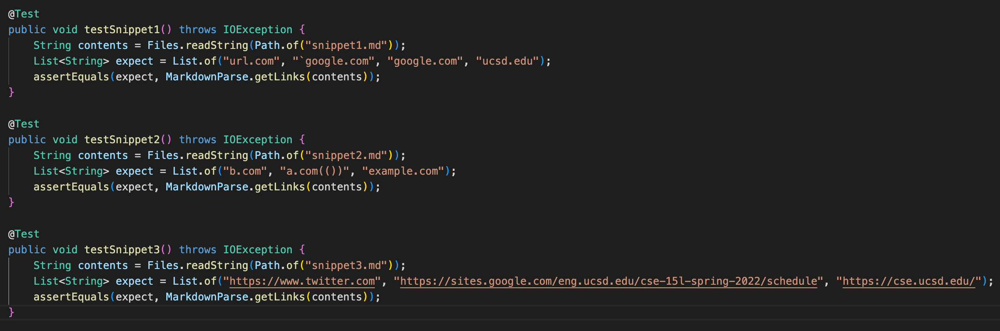
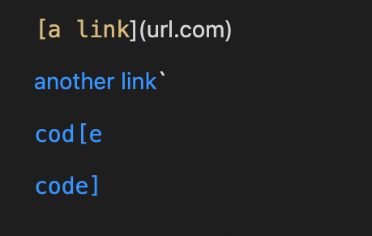
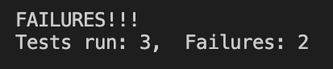
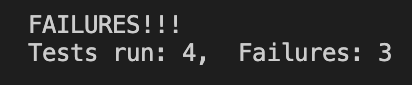
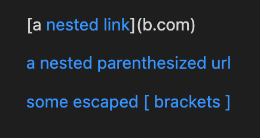
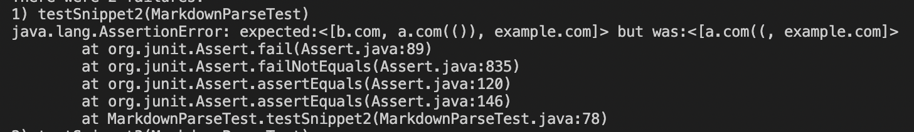
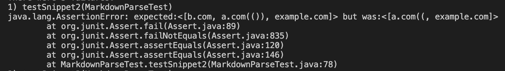
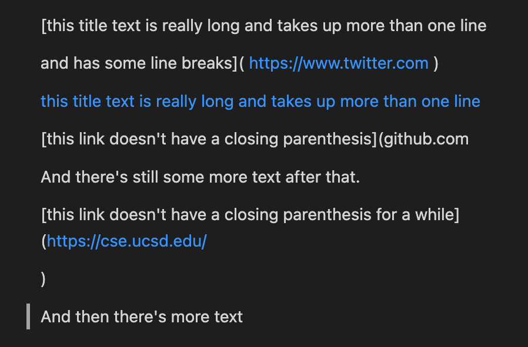
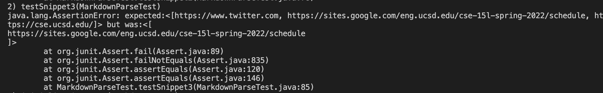

# Lab Report 4

[Link to my markdownParse repo](https://github.com/adrianmend25/Lab-Report-2)

[Link to peer's markdownParse repo](https://github.com/ehsly/markdown-parser)

##  MarkdownParseTest.java Tests

---
## Snippet 1 - (Pass/Pass)

> Expected

> Test passes on my implementation

> Test passes on peer's implementation

---
## Snippet 2 - (Fail/Fail)

> Expected

> Test fails on my implementation

> Test fails on peer's implementation

---
## Snippet 3 - (Fail/Fail)

> Expected 

> Test fails on my implementation

> Test fails on peer's implementation

---
## Questions

### Do you think there is a small (<10 lines) code change that will make your program work for snippet 1 and all related cases that use inline code with backticks? If yes, describe the code change. If not, describe why it would be a more involved change.

> My code passes because it only checks for what's inside of the brackets and parenthesis and accounts for abstract characters like backticks. If there is a backtick or another character like that, it is included in the URL.

### Do you think there is a small (<10 lines) code change that will make your program work for snippet 2 and all related cases that nest parentheses, brackets, and escaped brackets? If yes, describe the code change. If not, describe why it would be a more involved change.

> The brackets within the brackets would be a complicated issue to fix but can probably be resolved within 10 lines. We would check for the last closing bracket after a valid opening bracket, while it is before a valid URL within parenthesis, and then use the texts within the outer brackets to represent the URL.

### Do you think there is a small (<10 lines) code change that will make your program work for snippet 3 and all related cases that have newlines in brackets and parentheses? If yes, describe the code change. If not, describe why it would be a more involved change.

> This fix would not take up many lines and just check for the next available closing bracket/parenthesis after there is an opening bracket/parenthesis. It would also have to ignore links within parenthesis that do not close, which would be the harder issue to fix.